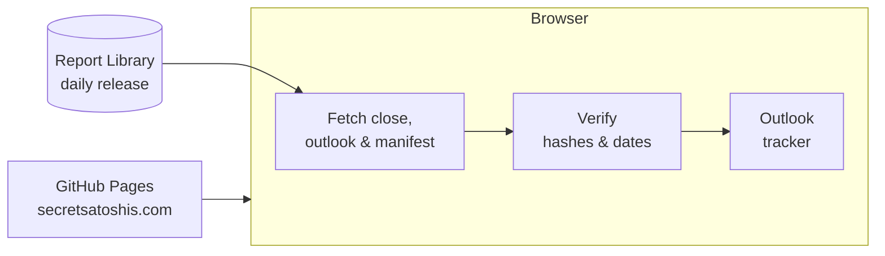

# Secret Satoshis

The home page of [Secret Satoshis](https://secretsatoshis.com/): Bitcoin market analysis and
open data, built on a decade inside Bitcoin markets. The site introduces the platform, tracks
the year's Bitcoin price outlook against the latest daily close, and points visitors to the
newsletter, Agent 21, the Market Dashboard and the Chart Library.

- **Visit the site:** [secretsatoshis.com](https://secretsatoshis.com/)
- **Read the newsletter:** [newsletter.secretsatoshis.com](https://newsletter.secretsatoshis.com/)

## What's on the site

| Section | What it does |
|---------|--------------|
| **Hero** | The tagline, "Bitcoin intelligence you can verify", and a link to the price outlook |
| **Newsletter** | The yearly, weekly, quarterly and year-end issues, the live outlook tracker, and a sign-up form that goes straight to Substack |
| **The Platform** | How market experience, research, open data and Agent 21 fit together |
| **Agent 21** | A short animated conversation, with a link to Agent 21 on ChatGPT |
| **Your Next Step** | Start Here, the Market Dashboard, the Chart Library and *Should I buy bitcoin?* |

Alongside the home page are a privacy page, a 404 page, a sitemap, `robots.txt`, and
[`llms.txt`](llms.txt), a short guide to the platform for AI agents.

## How it works



The site is plain HTML, CSS and JavaScript with no build step and no dependencies. GitHub
Pages serves the `main` branch at the custom domain in `CNAME`, so every push to `main` goes
live. Fonts are self-hosted, and the pages load nothing from other services except the
outlook tracker's data, which each page's Content-Security-Policy allows from the Report
Library's release only.

## The outlook tracker

The newsletter section shows where Bitcoin's latest daily close sits against the year's
published bear, base and bull cases. Nothing in it is hardcoded: `js/main.js` reads three files
from the [Report Library's release](https://secretsatoshis.github.io/Bitcoin-Report-Library/csv/release_manifest.json):

| File | What the tracker uses |
|------|-----------------------|
| `report_ohlc_summary.csv` | The latest daily close and its date |
| `price_outlook.csv` | The case levels (rows typed `case`) and the year they forecast |
| `release_manifest.json` | The release's report date and the SHA-256 hash of each file |

The tracker stays hidden if any file can't be fetched, the case levels are malformed, the
files' hashes or report date don't match the manifest, or the outlook is for a different year
than the latest close. A hidden tracker logs the reason to the browser console. If the data
ever moves, update `connect-src` in `index.html`'s Content-Security-Policy to match.

## Quick start

Serve the folder over HTTP, so root-relative links and browser security behave as they do in
production:

```bash
python3 -m http.server 8000
```

Then open [http://localhost:8000](http://localhost:8000). The outlook tracker reads the live
release, so it needs a network connection.

Run the tests with Node 20 or later (older versions run only some of them):

```bash
node --test tests/*.test.cjs
```

They cover the tracker's parsing and release checks, and check that every page's local files
exist, share one cache version per asset, and load no fonts or styles from another service.
GitHub Actions runs them on every pull request and every push to `main`.

## Making changes

- **CSS or JavaScript:** pages load `css/fonts.css`, `css/style.css` and `js/main.js` with a
  version query, such as `style.css?v=26`. Raise the version of the file you changed on all
  three pages, so every visitor gets the new file. The tests fail if the pages disagree.
- **Page content:** update the page's `<lastmod>` in `sitemap.xml`.
- **Products, chart counts or links:** keep `llms.txt` in step with the site.

## Project layout

| Path | What's there |
|------|--------------|
| `index.html` | The home page |
| `privacy.html`, `404.html` | The privacy and not-found pages |
| `css/style.css` | All page styles |
| `css/fonts.css` | Self-hosted font rules, one per character set |
| `js/main.js` | The Agent 21 animation, navigation, scroll effects and outlook tracker |
| `assets/fonts/` | Syne and JetBrains Mono, with their licenses |
| `assets/images/` | The logo, favicon and social card |
| `llms.txt`, `robots.txt`, `sitemap.xml` | Guides for AI agents, crawlers and search engines |
| `tests/` | Outlook tracker and page checks |

## License

[GPL-3.0](LICENSE). The fonts are under the SIL Open Font License; see `assets/fonts/`.
