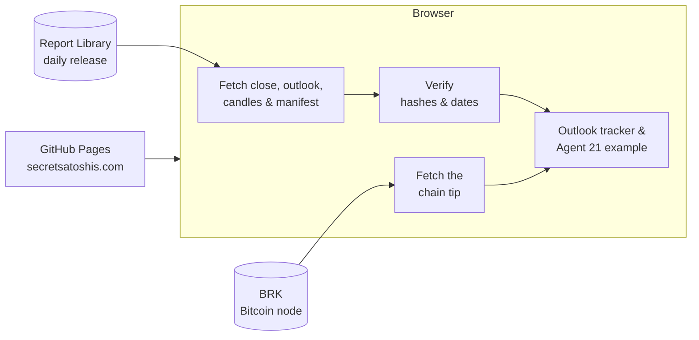

# Secret Satoshis

The home page of [Secret Satoshis](https://secretsatoshis.com/): Bitcoin market analysis and
open data, built on a decade inside Bitcoin markets. The site introduces the platform, tracks
the year's Bitcoin price outlook against the latest daily close, and points visitors to the
newsletter, Agent 21, the Market Dashboard and the Chart Library.

- **Visit the site:** [secretsatoshis.com](https://secretsatoshis.com/)
- **Read the newsletter:** [newsletter.secretsatoshis.com](https://newsletter.secretsatoshis.com/)

## What's on the site

| Section | What it does |
|---------|--------------|
| **Hero** | "AI-Native Bitcoin Market Intelligence", a link to the price outlook, and Agent 21, which follows the cursor and links to its site |
| **Newsletter** | The yearly, weekly, quarterly and year-end issues, the live outlook tracker, and a sign-up form that goes straight to Substack |
| **Agent 21** | An example conversation with live figures and charts, ending in a link to Agent 21 |
| **Your Next Step** | Start Here, the Chart Library, the Market Dashboard and the open-source code on GitHub |

Alongside the home page are a privacy page, a 404 page, a sitemap, `robots.txt`, and
[`llms.txt`](llms.txt), a short guide to the platform for AI agents.

## How it works



The site is plain HTML, CSS and JavaScript with no build step and no dependencies. GitHub
Pages serves the `main` branch at the custom domain in `CNAME`, so every push to `main` goes
live. Fonts are self-hosted, and the pages load nothing from other services except live data:
the Report Library's release, for the outlook tracker and the Agent 21 example, and the chain
tip from [BRK](https://bitview.space/), for the example's supply answer. The home page's
Content-Security-Policy allows those two sources only.

The `agent21/` folder holds the Agent 21 app, which deploys separately to
[agent21.secretsatoshis.com](https://agent21.secretsatoshis.com/). Agent 21's face and the
hero layout are shared with it: `js/agent21-face.js` and `css/agent21-face.css`.

## The outlook tracker

The newsletter section shows where Bitcoin's latest daily close sits against the year's
published bear, base and bull cases. Nothing in it is hardcoded: `js/main.js` reads three files
from the [Report Library's release](https://secretsatoshis.github.io/Bitcoin-Report-Library/csv/release_manifest.json):

| File | What the tracker uses |
|------|-----------------------|
| `report_ohlc_summary.csv` | The latest daily close and its date |
| `price_outlook.csv` | The case levels (rows typed `case`) and the year they forecast |
| `release_manifest.json` | The release's report date and the SHA-256 hash of each file |

The tracker stays hidden if any file can't be fetched, the case levels are malformed, the
files' hashes or report date don't match the manifest, or the outlook is for a different year
than the latest close. A hidden tracker logs the reason to the browser console. If the data
ever moves, update `connect-src` in `index.html`'s Content-Security-Policy to match.

## The Agent 21 example

The Agent 21 section plays a conversation between Satoshi and Agent 21 as it scrolls into
view. `js/agent21-chat.js` builds it from figures that `js/main.js` loads and checks:

| Source | What the example uses |
|--------|-----------------------|
| `bitcoin_candles.csv.gz` | Every weekly close since 2010 and the closes on the day Satoshi left and the latest day, checked against the release manifest |
| BRK `subsidy_cumulative` | The block height and bitcoin mined now, and on the day Satoshi left, checked against the issuance schedule |

An answer whose source can't be read is shortened or left out, and the reason is logged to the
browser console.

## Quick start

Serve the folder over HTTP, so root-relative links and browser security behave as they do in
production:

```bash
python3 -m http.server 8000
```

Then open [http://localhost:8000](http://localhost:8000). The outlook tracker and the Agent 21
example read live data, so they need a network connection.

Run the tests with Node 20 or later (older versions run only some of them):

```bash
node --test tests/*.test.cjs
```

They cover the tracker's and the example's parsing and data checks, and check that every page's
local files exist, share one cache version per asset, and load no fonts or styles from another
service.
GitHub Actions runs them on every pull request and every push to `main`.

## Making changes

- **CSS or JavaScript:** pages load their stylesheets and scripts with a version query, such
  as `style.css?v=26`. Raise the version of the file you changed on every page that loads it,
  so every visitor gets the new file. The tests fail if the pages disagree. `js/agent21-face.js`
  is imported by `js/agent21-hero.js` and `js/agent21-chat.js` with its own `?v=`: raise it in
  both, and those two scripts' versions in `index.html`.
- **Page content:** update the page's `<lastmod>` in `sitemap.xml`.
- **Products, chart counts or links:** keep `llms.txt` in step with the site.

## Project layout

| Path | What's there |
|------|--------------|
| `index.html` | The home page |
| `privacy.html`, `404.html` | The privacy and not-found pages |
| `css/style.css` | Page styles |
| `css/agent21-face.css` | Agent 21's face and the hero, shared with the Agent 21 app |
| `css/fonts.css` | Self-hosted font rules, one per character set |
| `js/main.js` | Navigation, scroll effects, the outlook tracker and the Agent 21 example's data |
| `js/agent21-face.js` | Draws and animates Agent 21, shared with the Agent 21 app |
| `js/agent21-hero.js`, `js/agent21-chat.js` | The hero's Agent 21 and the example conversation |
| `assets/fonts/` | Syne and JetBrains Mono, with their licenses |
| `assets/images/` | The logo, favicon and social card |
| `llms.txt`, `robots.txt`, `sitemap.xml` | Guides for AI agents, crawlers and search engines |
| `tests/` | Outlook tracker, Agent 21 example and page checks |
| `agent21/` | The Agent 21 app, deployed separately |

## License

[GPL-3.0](LICENSE). The fonts are under the SIL Open Font License; see `assets/fonts/`.
